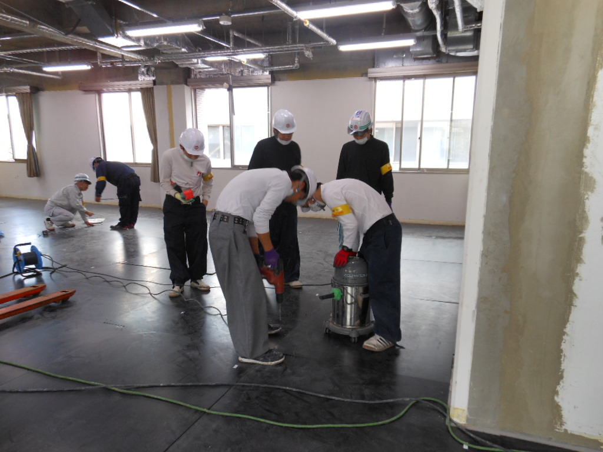
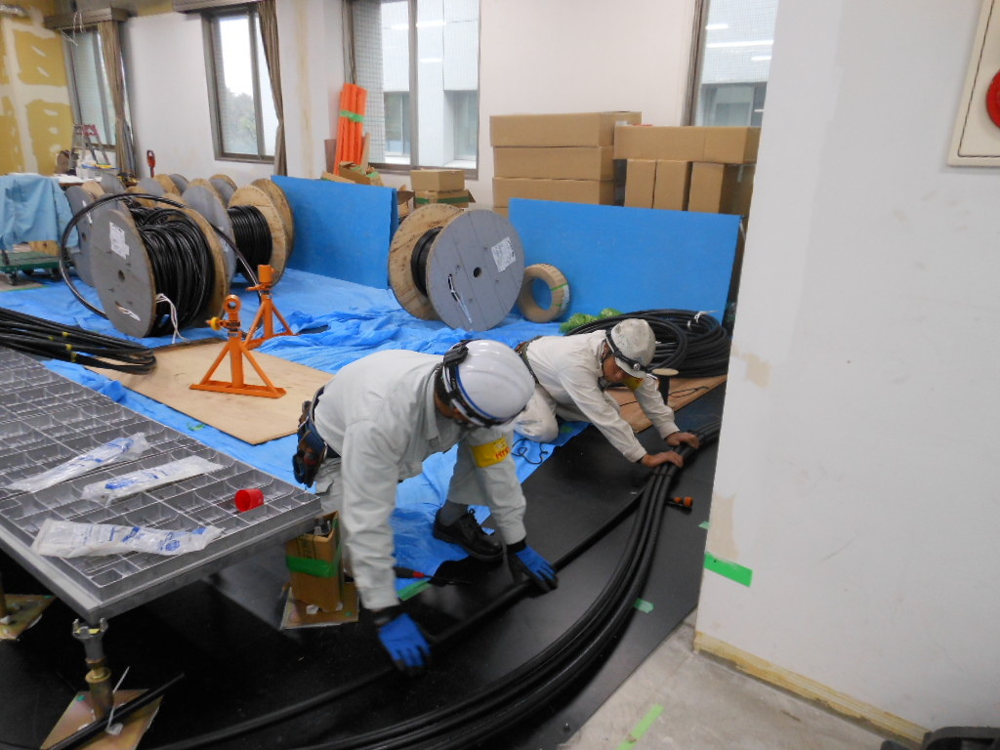
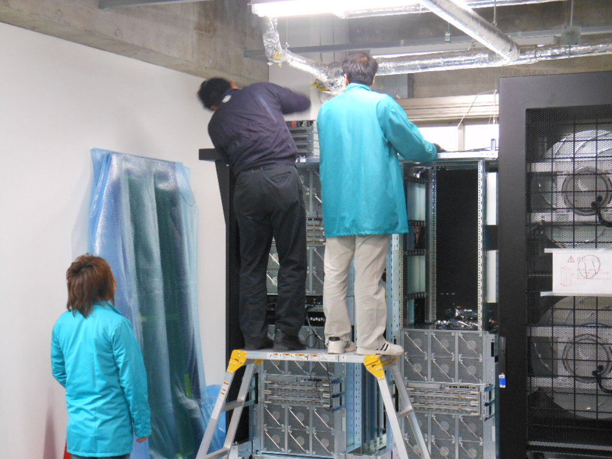
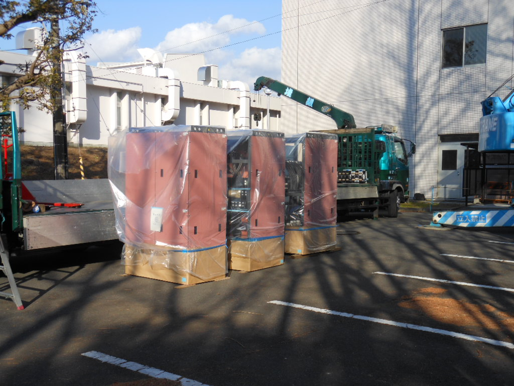
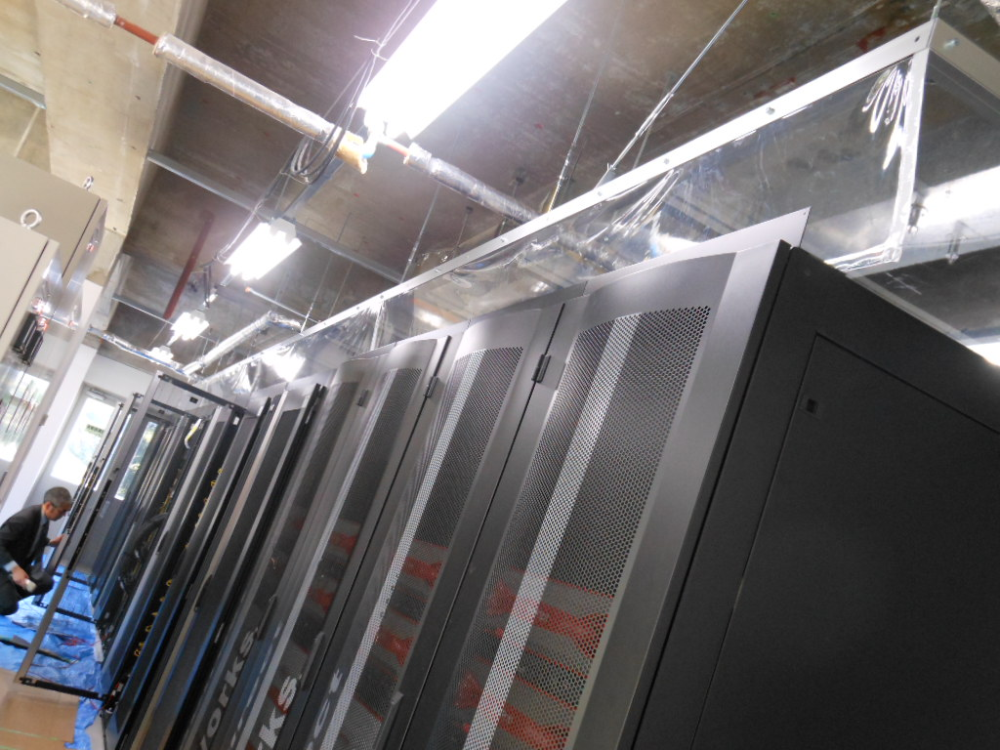

# 遺伝研スパコン構築風景

遺伝研の新しいスーパーコンピューターは2012年3月1日稼働開始予定です。

遺伝研の現在のスーパーコンピューターは遺伝研電子計算機棟3Fに設置されていますが、
今回のスーパーコンピューターのリプレースに際して遺伝研電子計算機棟2Fに計算機室を新設し、
現在、新計算機室に新スパコンを構築する作業を行っています。

写真撮影 : 塩島さん、窪寺さん

<table>
<tr>
<td></td>
<td><a href="docs/新スパコン構築風景2011年11月上旬.md">新スパコン構築風景 2011年11月上旬</a></td>
</tr>
<tr>
<td></td>
<td><a href="docs/新スパコン構築風景2011年11月中旬.md">新スパコン構築風景2011年11月中旬</td>
</tr>
<tr>
<td></td>
<td><a href="docs/新スパコン構築風景2011年11月下旬.md">新スパコン構築風景2011年11月下旬</a></td>
</tr>
<tr>
<td></td>
<td><a href="docs/新スパコン構築風景2011年12月上旬.md">新スパコン構築風景 2011年12月上旬</a></td>
</tr>
<tr>
<td></td>
<td><a href="r6b85d">新スパコン構築風景 2011年12月中旬</a></td>
</tr>
<tr>
<td></td>
<td><a href="9r2dod">新スパコン構築風景 2011年12月下旬</a></td>
</tr>
<tr>
<td></td>
<td><a href="av63x1">新スパコン構築風景 2012年1月中旬 (その1)</a></td>
</tr>
<tr>
<td></td>
<td><a href="vohwz1">新スパコン構築風景 2012年1月中旬 (その2)</a></td>
</tr>
<tr>
<td></td>
<td><a href="9u9piy">新スパコン構築風景 2012年1月下旬</a></td>
</tr>
<tr>
<td></td>
<td><a href="bjg516">新スパコン構築風景 2012年2月上旬</a></td>
</tr>
</table>

