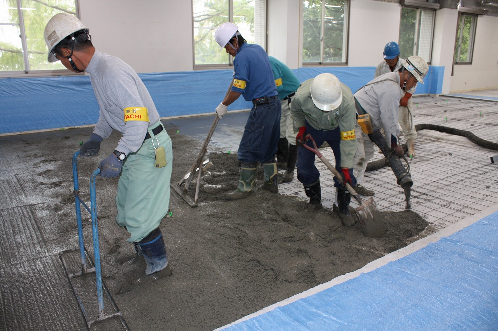

# 遺伝研スパコン構築風景

遺伝研の新しいスーパーコンピューターは2012年3月1日稼働開始予定です。

遺伝研の現在のスーパーコンピューターは遺伝研電子計算機棟3Fに設置されていますが、
今回のスーパーコンピューターのリプレースに際して遺伝研電子計算機棟2Fに計算機室を新設し、
現在、新計算機室に新スパコンを構築する作業を行っています。

写真撮影 : 塩島さん、窪寺さん

<table>
<tr><td></td><td><a href="docs/新スパコン構築風景11月上旬.md">新スパコン構築風景 2011年11月上旬</a></td></tr>
<tr><td></td><td>新スパコン構築風景 2011年11月下旬</td></tr>
</table>

