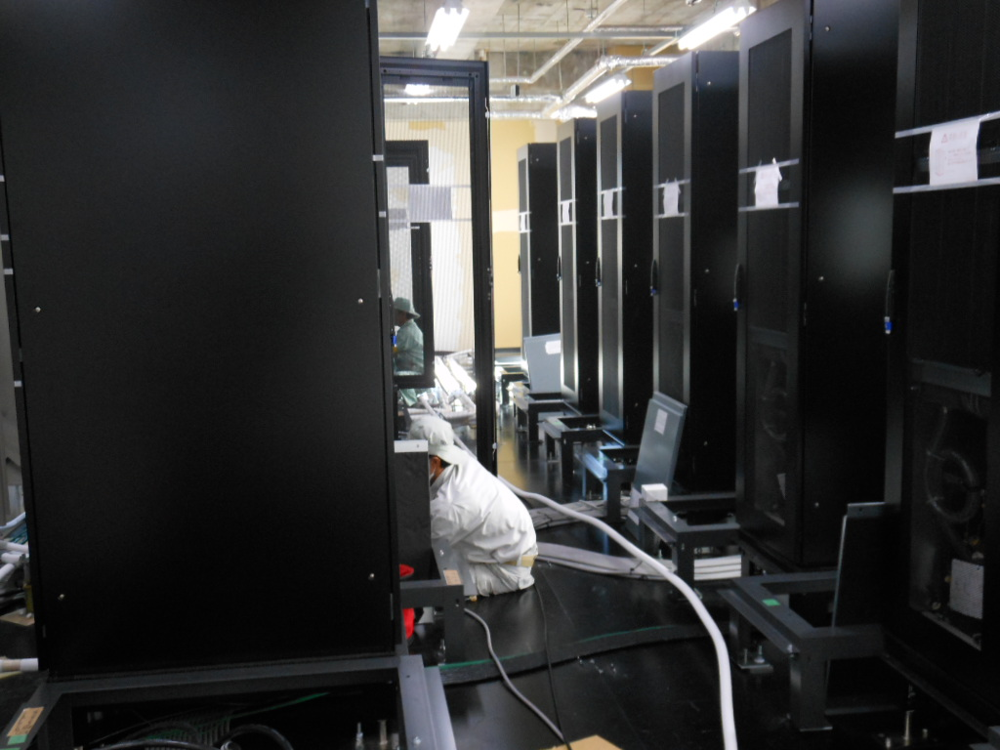

<table>
<tr>
<td>

</td>
<td>
2011-12-20サーバ・空調機の配線・配管作業が続きます
</td>
</tr>

<tr>
<td>

</td>
<td>
2011-12-20サーバ・空調機の配線・配管作業が続きます
</td>
</tr>

<tr>
<td>

</td>
<td>
2011-12-21本日の作業内容です
</td>
</tr>

<tr>
<td>

</td>
<td>
2011-12-21ラック型空調機を後ろから見ると・・・ターボファンが見えます</td>
</tr>

<tr>
<td>

</td>
<td>
2011-12-21サーバ・空調機の配線・配管作業が続きます
</td>
</tr>

<tr>
<td>

</td>
<td>
2011-12-21空調機からの配管は屋上の室外機に接続されます
</td>
</tr>

<tr>
<td>

</td>
<td>
2011-12-22本日も引き続き配管・電源接続作業です。
</td>
</tr>

<tr>
<td>

</td>
<td>
2011-12-22床下の配線。
</td>
</tr>

<tr>
<td>

</td>
<td>
2011-12-22床の支柱をしっかり固定してあります。
</td>
</tr>

<tr>
<td>

</td>
<td>
2011-12-22分電盤の電源をつなぐ作業。
</td>
</tr>

<tr>
<td>

</td>
<td>
2011-12-22現場監督さん他工事工程の確認作業。
</td>
</tr>

<tr>
<td>

</td>
<td>
2011-12-22荷重分散鉄板の端をそろえています。
</td>
<tr>

<td>

</td>
<td>
2011-12-26サーバ・空調機の配線・配管作業が続きます

</td>
</tr>

<tr>
<td>

</td>
<td>
2011-12-26サーバ・空調機の配線・配管作業が続きます

</td>
</tr>
<tr>
<td>

</td>
<td>
2011-12-26床材をはめ込むスペースの寸法を測り、
</td>
</tr>

<tr>
<td>

</td>
<td>
2011-12-26床材を寸法どおりに切ります
</td>
</tr>

<tr>
<td>

</td>
<td>
2011-12-26空調機の配線作業
</td>
</tr>

<tr>
<td>

</td>
<td>
2011-12-26 3階からランケーブルを新スパコン室に引き込む作業です</td>
</tr>

<tr>
<td>

</td>
<td>
2011-12-27 中央の通路の床材がきっちりとはめ込まれました</td>
</tr>

<tr>
<td>

</td>
<td>
2011-12-27 空調用動力盤から分電盤に通電が始まりました</td>
</tr>

<tr>
<td>

</td>
<td>
2011-12-28 sgiサーバがトラックにて到着。</td>
</tr>

<tr>
<td>

</td>
<td>
2011-12-28 900kgあるサーバはエレベーターでは運べません。クレーンでつり上げて、２階まで。</td>
</tr>

<tr>
<td>

</td>
<td>
2011-12-28 慎重につり上げます。</td>
</tr>

<tr>
<td>

</td>
<td>
2011-12-28 あっという間にもちあがります。</td>
</tr>

<tr>
<td>

</td>
<td>
2011-12-28 電子計算機棟西側から搬入です。</td>
</tr>

<tr>
<td>

</td>
<td>
2011-12-28 手際よく搬入。 </td>
</tr>

<tr>
<td>

</td>
<td>
2011-12-28 一台目が室内に到着。 </td>
</tr>

<tr>
<td>

</td>
<td>
2011-12-28 二台目搬入。 </td>
</tr>

<tr>
<td>

</td>
<td>
2011-12-28 搬入後のチェック。 </td>
</tr>

<tr>
<td>

</td>
<td>
2011-12-28 「大丈夫！」 </td>
</tr>

</table>
