写真撮影 : 塩島さん、窪寺さん

<table>
<tr>
<td>
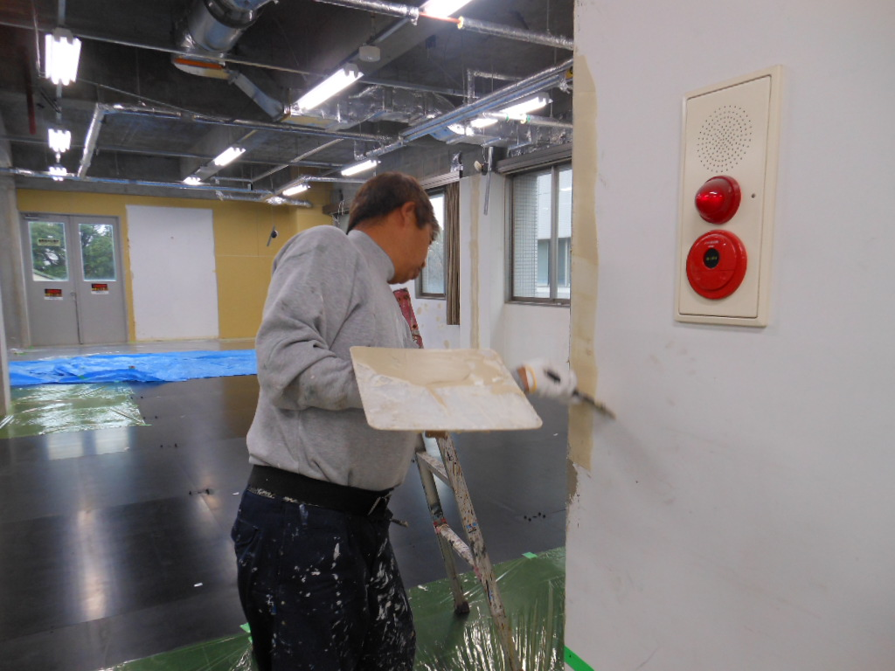
</td>
<td>
2011-12-01破損した柱および壁を修復した後の塗装作業
</td>
</tr>

<tr>
<td>

2011-12-01全体の壁の塗装作業</td>
</tr>

<tr>
<td>
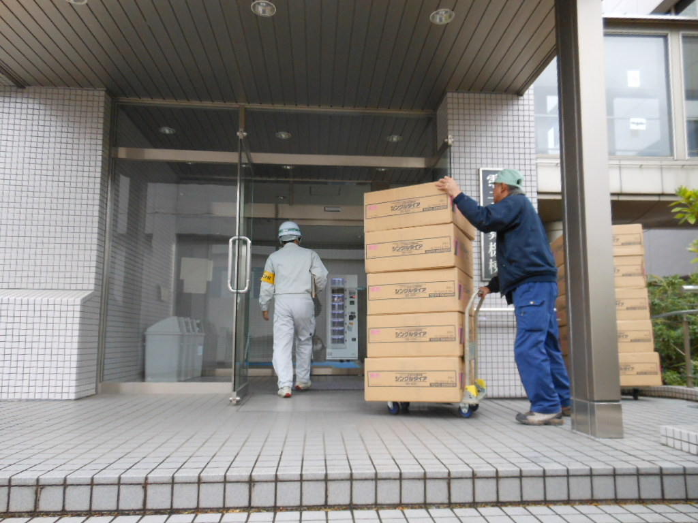
</td>
<td>
2011-12-01シングルダイヤ（エアコン配管用被履配管＝冷媒の配管用）が運び込まれました</td>
</tr>

<tr>
<td>
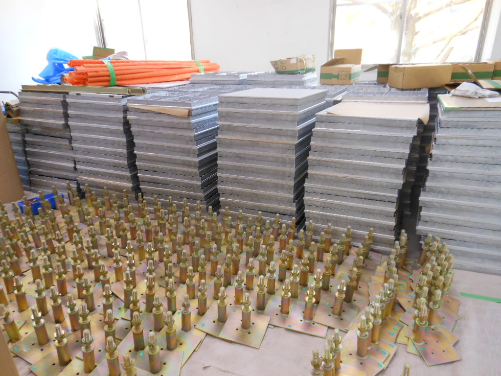
</td>
<td>
2011-12-05新スパコン室の床を上げるための資材</td>
</tr>

<tr>
<td>
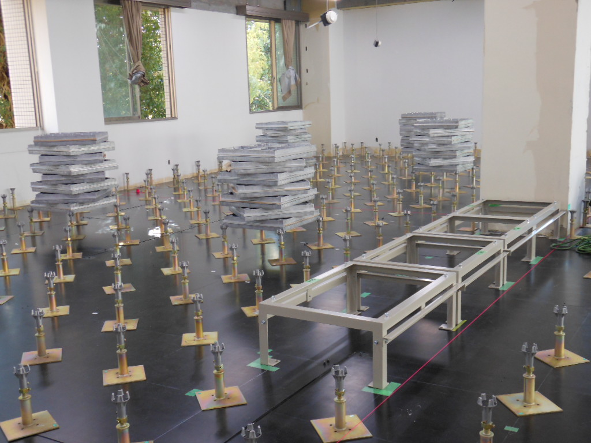
</td>
<td>
2011-12-05床を上げるために支柱を立てています</td>
</tr>

<tr>
<td>
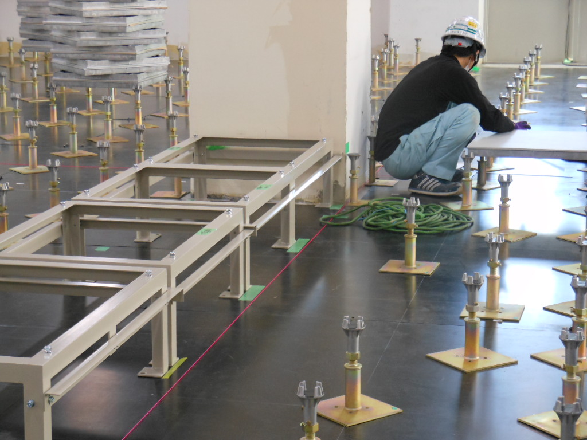
</td>
<td>
2011-12-05床面が支柱の上にのせられます</td>
</tr>

<tr>
<td>
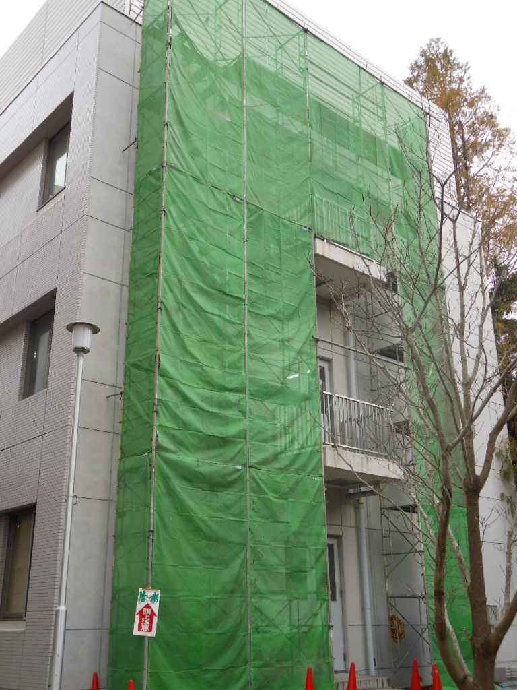
</td>
<td>
2011-12-05電子計算棟西側の壁から屋上に空調機の配管が設置されています 
屋上の室外機に接続されます
</td>
</tr>
<tr>
<td>
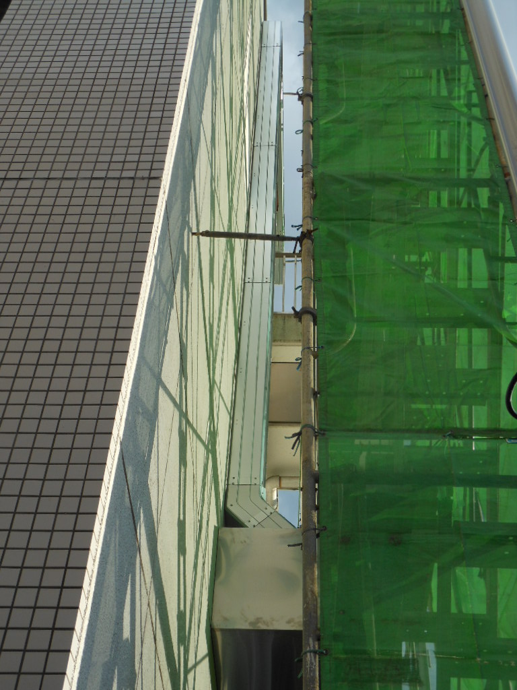
</td>
<td>
2011-12-05電子計算棟西側の壁から屋上に空調機の配管が設置されています 
屋上の室外機に接続されます
</td>
</tr>

<tr>
<td>

</td>
<td>
2011_12_06床面は400mm上がり、骨組みの下270mmの空間に電気および空調のコードが配管されます
</td>
</tr>
<tr>
<td>
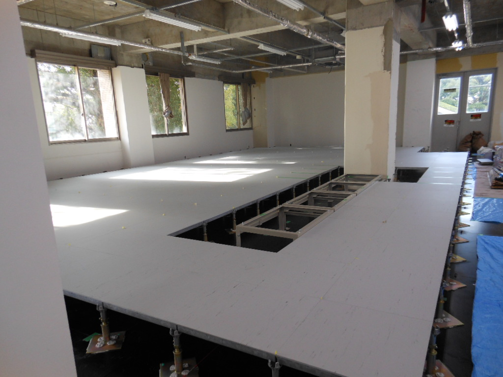
</td>
<td>
2011_12_07今日は作業はありません
</td>
</tr>

<tr>
<td>
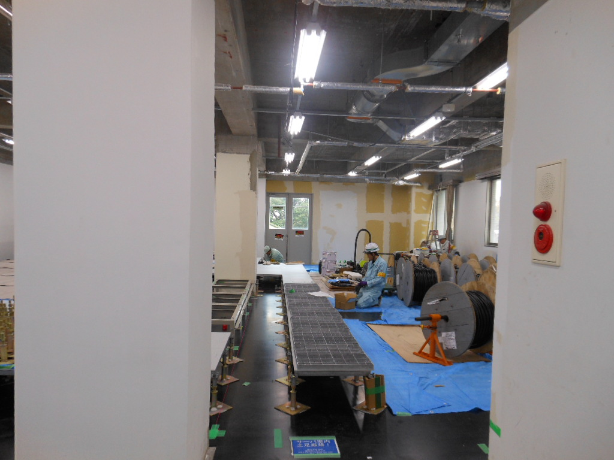
</td>
<td>
2011-12-08</td>
</tr>

<tr>
<td>
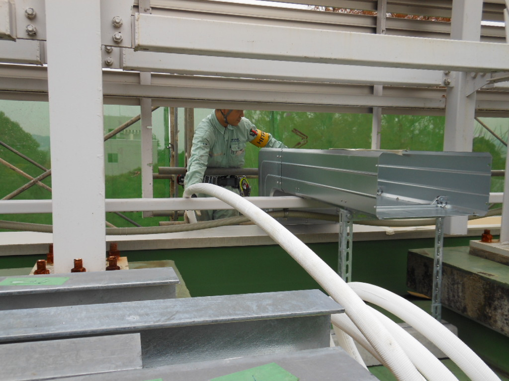
</td>
<td>
2011-12-08</td>
</tr>

<tr>
<td>
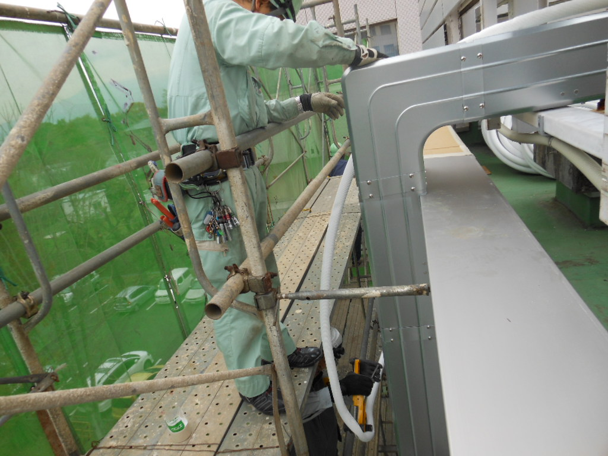
</td>
<td>
2011-12-08</td>
</tr>

<tr>
<td>
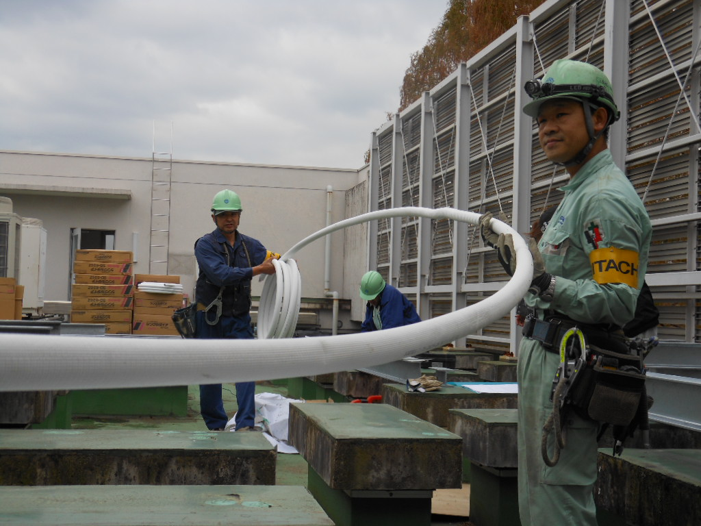
</td>
<td>
2011-12-08</td>
</tr>

<tr>
<td>
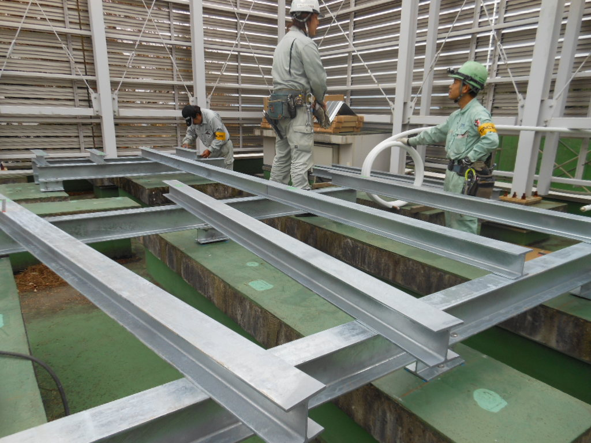
</td>
<td>
2011-12-08</td>
</tr>

<tr>
<td>
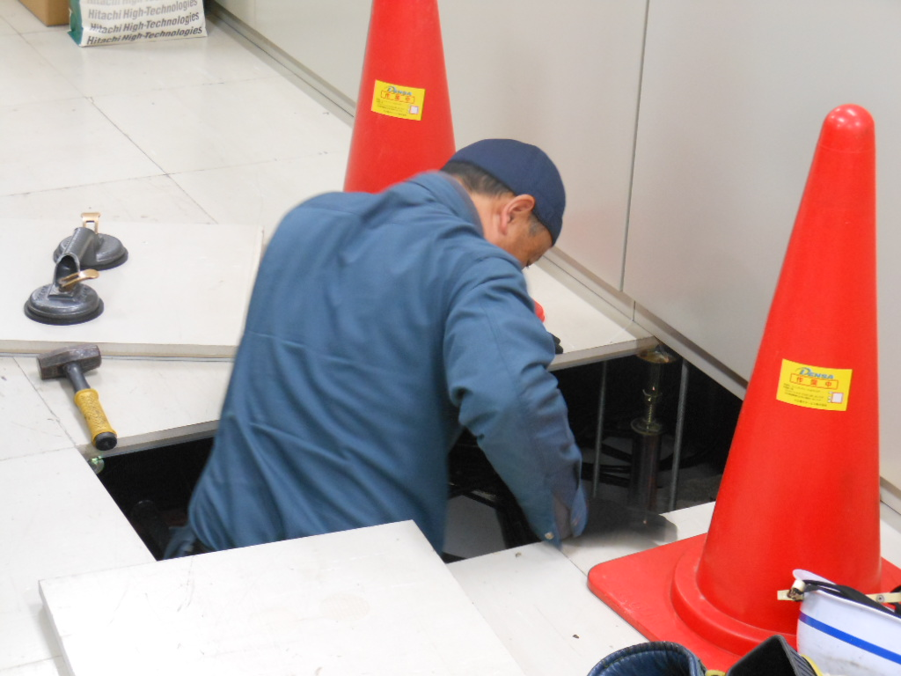
</td>
<td>
2011-12-08</td>
</tr>

<tr>
<td>

</td>
<td>
2011-12-08</td>
</tr>

<tr>
<td>

</td>
<td>
2011-12-08</td>
</tr>

<tr>
<td>

</td>
<td>
2011-12-08</td>
</tr>

<tr>
<td>

</td>
<td>
2011-12-08</td>
</tr>

<tr>
<td>

</td>
<td>
2011-12-08</td>
</tr>
<tr>
<td>

</td>
<td>
2011-12-08</td>
</tr>

<tr>
<td>

</td>
<td>
2011-12-08</td>
</tr>

<tr>
<td>

</td>
<td>
2011-12-08 電源ケーブル敷設開始
</td>
</tr>

<tr>
<td>

</td>
<td>
2011-12-08 電源ケーブル敷設中
</td>
</tr>

<tr>
<td>

</td>
<td>
2011-12-09 電源ケーブル敷設  
UPS室の壁からケーブルを出しているところ。
</td>
</tr>

</table>
